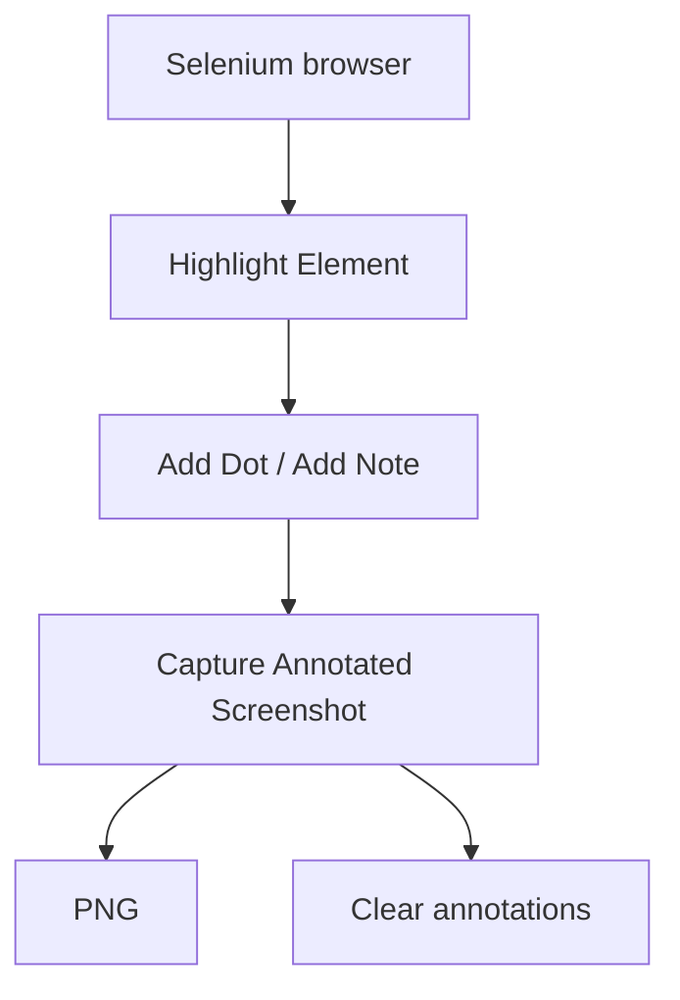

## Make the evidence easy to follow

- **Highlight**

    Point to the field or component that matters.

- **Explain**

    Guide the reader with numbered dots and short notes.

- **Capture**

    Save the annotated viewport and clear the marks by default.

Use it from Python or Robot Framework with the same behavior. MIT licensed, with source and executable examples on GitHub.

## What it does

- Keep highlights visible until explicitly cleared.
- Explain a sequence with numbered dots and notes.
- Capture a PNG and clean marks automatically, including on capture failure.
- Work with your existing SeleniumLibrary browser.

## See the annotation flow

[Explore real screenshots](examples.md){ data-preview }
