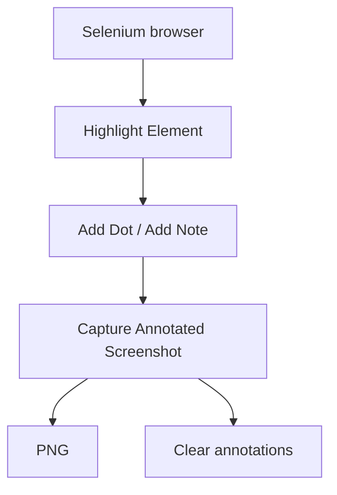

<div id="overview"></div>

## From element to evidence.

<div class="grid cards" markdown>

- **Highlight.**

    Point to the field or component that matters.

- **Explain.**

    Guide the reader with numbered dots and short notes.

- **Capture.**

    Save the annotated viewport and clear the marks by default.

</div>

Use it from Python or Robot Framework with the same behavior. MIT licensed, with source and executable examples on GitHub.

<div class="mk-real-example" markdown>

## What an annotated screenshot looks like


This screenshot is generated through Marka's Python API on the example form: it highlights the updated email, numbers the steps and adds a note beside the button. The image is the actual annotation output.

[Explore the code and interactive demo](examples.md)

</div>

## Annotate from your tests

Use the browser already opened by SeleniumLibrary. Capture saves the viewport as a PNG and clears annotations by default.

```robotframework hl_lines="8-11"
*** Settings ***
Library    SeleniumLibrary
Library    Marka

*** Keywords ***
Explain Profile Changes
    Highlight Element    id:email    color=coral
    Add Dot    id:email    text=1    position=left
    Add Note    id:save    text=Save changes    position=right
    Capture Annotated Screenshot    ${OUTPUT DIR}/profile.png
```

[Installation and user guide](guide.md) · [Keyword reference](keywords/index.html)

## What it does

- Keep highlights visible until explicitly cleared.
- Explain a sequence with numbered dots and notes.
- Capture a PNG and clean marks automatically, including on capture failure.
- Work with your existing SeleniumLibrary browser.

## See the annotation flow



[Explore real screenshots](examples.md){ data-preview }
