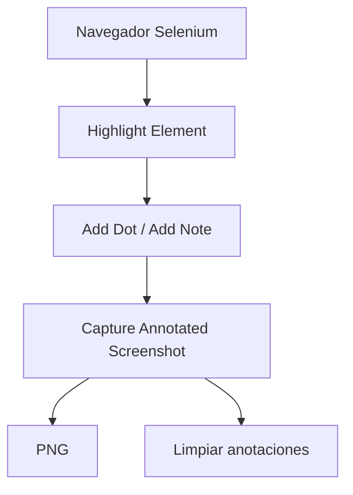

<div id="overview"></div>

## Del elemento a la evidencia.

<div class="grid cards" markdown>

- **Resalta.**

    Señala el campo o componente que importa.

- **Explica.**

    Guía al lector con puntos numerados y notas breves.

- **Captura.**

    Guarda el viewport anotado y limpia las marcas por defecto.

</div>

Úsala desde Python o Robot Framework con el mismo comportamiento. Licencia MIT, código y ejemplos ejecutables en GitHub.

<div class="mk-real-example" markdown>

## Así se ve una captura anotada


Esta captura se genera con la API Python de Marka sobre el formulario del ejemplo: resalta el correo actualizado, señala los pasos y agrega una nota junto al botón. La imagen es el resultado real de la anotación.

[Explora el código y la demo interactiva](examples.md)

</div>

## Anota desde tus pruebas

Usa el navegador que ya abrió SeleniumLibrary. La captura guarda el viewport en PNG y limpia las anotaciones por defecto.

```robotframework hl_lines="8-11"
*** Settings ***
Library    SeleniumLibrary
Library    Marka

*** Keywords ***
Explicar cambios de perfil
    Highlight Element    id:email    color=coral
    Add Dot    id:email    text=1    position=left
    Add Note    id:save    text=Guardar cambios    position=right
    Capture Annotated Screenshot    ${OUTPUT DIR}/perfil.png
```

[Instalación y guía de usuario](guide.md) · [Referencia de keywords](keywords/index.html)

## Qué hace

- Mantiene el resaltado hasta que lo retires.
- Explica una secuencia con puntos numerados y notas.
- Captura un PNG y limpia las marcas automáticamente, incluso si falla la captura.
- Usa el navegador que ya abriste con SeleniumLibrary.

## Conoce el flujo de anotación



[Explora capturas reales](examples.md){ data-preview }
