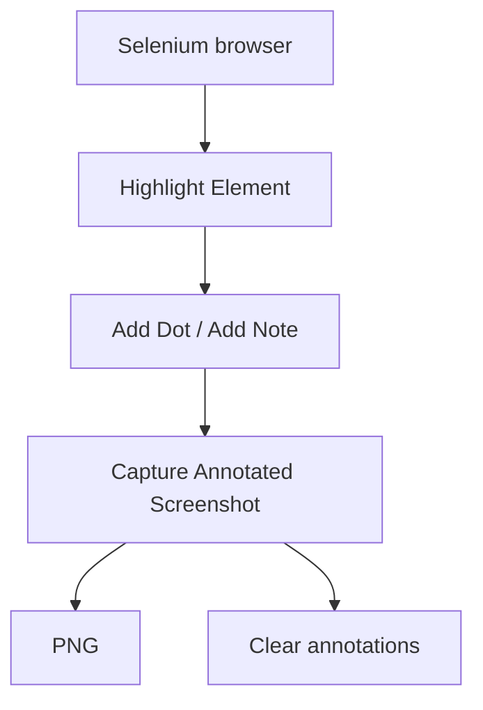

## Haz que la evidencia sea fácil de seguir

- **Resalta**

    Señala el campo o componente que importa.

- **Explica**

    Guía al lector con puntos numerados y notas breves.

- **Captura**

    Guarda el viewport anotado y limpia las marcas por defecto.

Úsala desde Python o Robot Framework con el mismo comportamiento. Licencia MIT, código y ejemplos ejecutables en GitHub.

## Qué hace

- Mantiene el resaltado hasta que lo retires.
- Explica una secuencia con puntos numerados y notas.
- Captura un PNG y limpia las marcas automáticamente, incluso si falla la captura.
- Usa el navegador que ya abriste con SeleniumLibrary.

## Conoce el flujo de anotación

[Explora capturas reales](examples.md){ data-preview }
